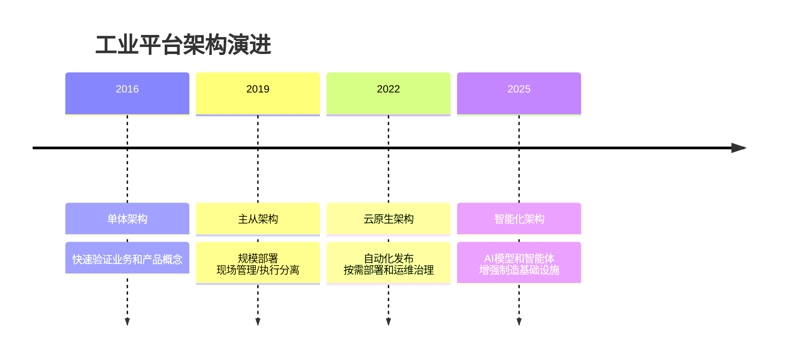

---
title: 架构演进脉络
section: 架构知识
created: 2026-06-16
status: active
area: architecture
kind: evolution
topic: industrial-platform-evolution
parent:
  - '[工业智能平台总体架构](/10_Architecture/11 平台总览/工业智能平台总体架构/)'
related:
  - '[工业智能平台总体架构](/10_Architecture/11 平台总览/工业智能平台总体架构/)'
  - '[服务器需求](/10_Architecture/13 架构参考/服务器需求/)'
  - '[软件版本信息](/10_Architecture/13 架构参考/软件版本信息/)'
  - '[工业数据接入](/20_Domain_Knowledge/21 工业数据接入/00 接入模式/)'
  - '[曲线质量分析](/20_Domain_Knowledge/22 曲线质量分析/00 曲线分析系统领域知识/)'
  - '[时间性能分析](/20_Domain_Knowledge/23 时间性能分析/00 时间性能系统领域知识/)'
  - '[预测性维护](/20_Domain_Knowledge/24 预测性维护/00 PDM业务领域知识笔记/)'
---
## 阅读导引

这篇笔记单独整理“架构演进”，避免它只被吸收到架构总览里。它关注的是：平台为什么从单体走向主从、云原生、平台化和智能化。

## 演进主线

## 阶段理解

### 1. 单体架构：快速落地

早期目标是快速实现业务闭环，例如产线规划、预测维护、时间性能等应用。优点是开发快、验证快；缺点是系统边界和复用能力不足。

### 2. 主从架构：适应工厂规模部署

随着现场部署规模扩大，需要区分管理侧和执行侧。主从架构解决的是工厂多产线、多工位、多设备下的组织和运行问题。

### 3. 云原生架构：提升部署和运维能力

云原生阶段关注自动化发布、服务化、监控、日志、配置、弹性和环境一致性。它让平台从“项目软件”开始向“可持续运维的平台”演进。

### 4. 平台化：沉淀公共能力

权限、节点、配置、数据管理、主站部署、接口规范等能力逐渐成为平台底座。业务系统不应重复建设这些能力。

### 5. 智能化：AI 进入制造基础设施

智能化阶段不是简单加模型，而是让模型、知识库、智能体和工业数据结合，服务于质量诊断、预测维护、工艺优化和知识复用。

## 演进带来的设计原则

- 把项目中重复出现的能力沉淀成平台能力。
- 把业务应用和平台底座拆开，减少系统边界混乱。
- 把数据接入标准化，否则智能化能力无法复用。
- 把交付经验沉淀为模板、检查清单和架构模式。

## 主要来源

- `架构介绍/架构演进介绍.pptx`
- `架构介绍/System Architecture_v1.0.pptx`
- `架构演进/img/`

