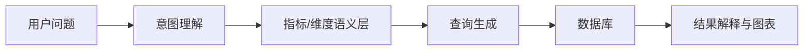

## 阅读导引

这篇笔记把 AI、智能体、ChatBI、知识库、RAG、提示工程和模型实践相关内容整理成可复用知识。

## 核心观点

### 1. 工业 AI 的知识库重点不只是 RAG，而是可验证

传统 RAG 常见链路是“问题 → 向量检索 → Top-K Chunk → LLM 回答”。但在工业场景里，仅能回答还不够，关键是：

- 回答能否追溯到明确来源；
- 检索结果是否经过重排和验证；
- 答案是否能解释边界条件和不确定性；
- 是否能把项目文档、说明书、接口和历史经验统一管理。

因此，知识库建设应优先关注 **Citation（可追溯引用）** 和 **Verification（验证）**。

### 2. ChatBI 的关键在语义层，而不是让模型直接写 SQL

ChatBI 类系统要稳定落地，需要在数据库和自然语言之间建立语义层：

如果缺少语义层，模型直接生成 SQL 会带来字段歧义、指标口径不一致、权限和安全问题。

### 3. 多智能体适合工业系统，但要控制上下文污染

OneNote 中多次讨论了分层智能体/多智能体：主智能体负责协调，领域智能体负责具体系统，例如 IRUN、拧紧、产线性能等。这种模式适合工业平台，但要注意：

- 主智能体不能越权直接执行子智能体技能；
- 子智能体需要保留自己的领域记忆；
- 调度链路过长会导致延迟和上下文污染；
- 用户入口应尽量统一，内部再做路由。

### 4. 提示工程是产品能力，不只是技巧

提示工程可分为指令、上下文、输入数据和输出格式四部分。工业场景中尤其要强调：

- 输出格式稳定；
- 引用来源清楚；
- 对不确定数据明确说明；
- 避免模型把推测当事实；
- 对操作类任务保留确认机制。

### 5. 模型选型应按任务拆分

不同模型适合不同任务：

- LLM：综合理解、问答、规划、报告生成；
- Embedding：文档召回；
- Reranker：提升检索质量；
- 专用模型：曲线异常、质量诊断、预测维护。

工业 AI 平台不应只依赖一个大模型，而应采用“LLM + 检索 + 专用模型 + 工具”的组合。

